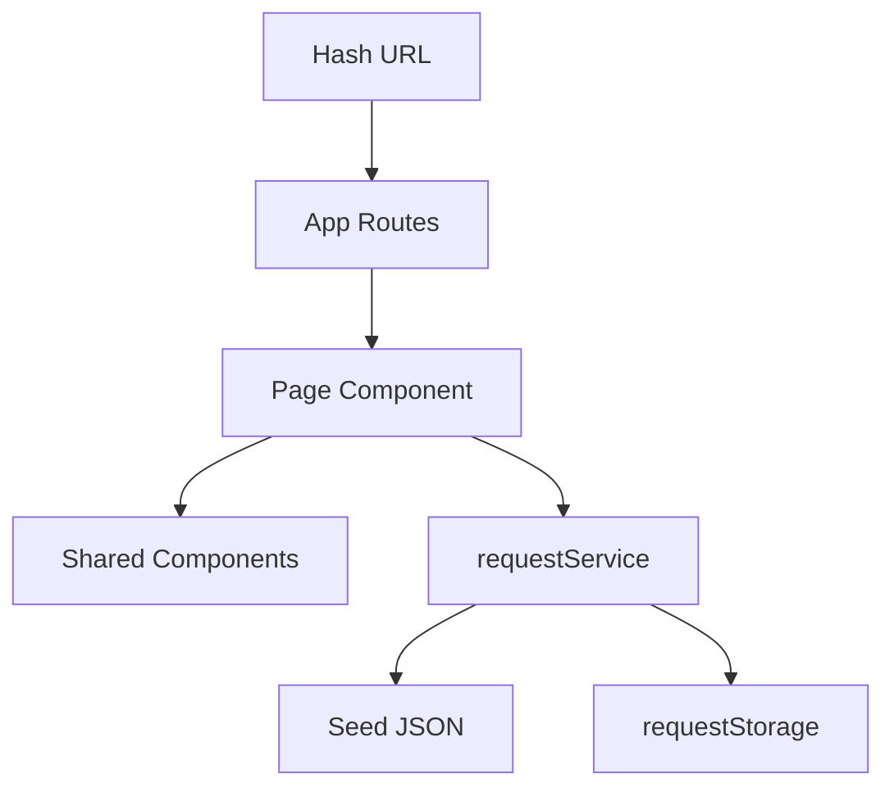

# ENGSE203 LAB05 Starter — Campus Service Request

Starter นี้เปิดได้และรักษาพฤติกรรมแกนของ Week04 แบบ in-memory แต่ตั้งใจยังไม่ผ่าน LAB05 ทุกข้อ ให้ทำตาม CP00–CP06 และรัน checker หลังแต่ละช่วง

## Run

```bash
npm ci
npm run dev
npm run check
npm run build
npm run preview
```

## Starting state

- `HashRouter` และ dependency เตรียมไว้เป็น infrastructure
- Dashboard ยัง render โดยตรงและยังไม่ใช้ route matrix
- add/filter/delete ยังทำงานใน memory; refresh แล้วข้อมูลใหม่หาย
- Page/Service/Storage filenames และ validator scaffold เตรียมไว้
- deterministic `error`/`empty` scenario helper เตรียมไว้
- `npm run check` ต้องรายงาน `[TODO]` จนกว่าจะทำ CP ครบ

## Target architecture



- `App.jsx` กำหนด route matrix
- `pages/` เป็นเจ้าของ route-specific state และ lifecycle
- `components/` รับข้อมูลและ handler ผ่าน props
- `requestService.js` เป็น data-access boundary ของ UI
- `requestStorage.js` เป็นไฟล์เดียวที่ใช้ `localStorage`

## TODO boundary

นักศึกษาประกอบ Routes/Navigation, Effect lifecycle, Service calls, persistence functions, dynamic detail และ regression checks เอง ส่วน schema validator, visual components, scenario delay และ checker infrastructure มีให้เป็น scaffold

## Privacy

ใช้ข้อมูลสาธิตเท่านั้น ห้ามบันทึก token, password, secret หรือข้อมูลส่วนบุคคลจริงใน `localStorage` หรือหลักฐานภาพ
